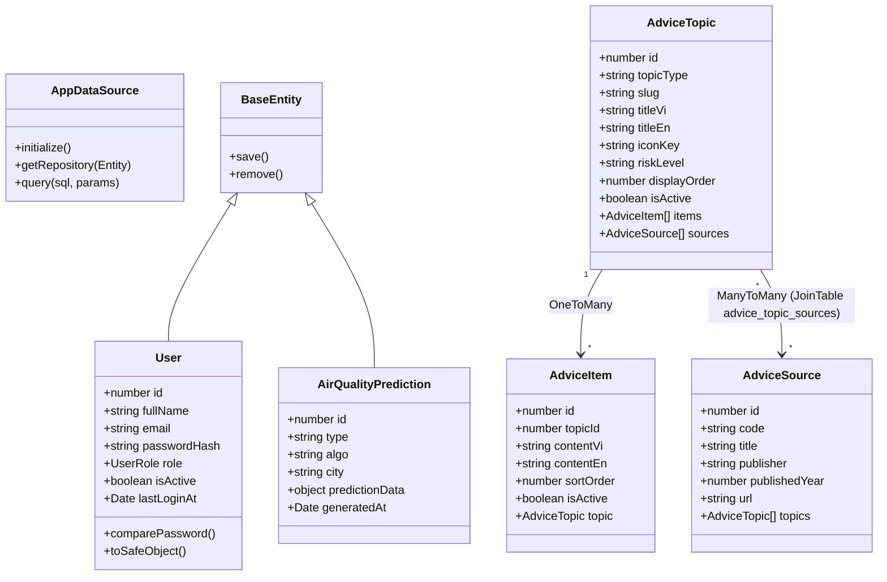

# Thiết kế Kỹ thuật (Spec): Chuyển đổi Toàn diện sang TypeORM & Tích hợp Cơ sở Dữ liệu Khuyến cáo Sức khỏe

**Tài liệu:** `docs/superpowers/specs/2026-10-03-health-advice-db-integration-design.md`  
**Ngày cập nhật:** 2026-10-03  
**Trạng thái:** Chờ duyệt (Pending Review)  
**Phạm vi:** 
- **Chuyển đổi ORM Backend:** Di chuyển toàn bộ tầng truy cập dữ liệu của `backend/` từ **Sequelize (`sequelize-typescript`)** sang **TypeORM (`typeorm`)**, gỡ bỏ triệt để Sequelize.
- **Tầng Database (PostgreSQL):** Hoàn thiện các ràng buộc toàn vẹn (`advice_*`) và seed dữ liệu nguồn trích dẫn y khoa (`advice_sources` S1–S8).
- **Backend TypeORM Entities & Services:** Chuyển đổi các entity hiện có (`User`, `AirQualityPrediction`), xây dựng mới các entity khuyến cáo (`AdviceTopic`, `AdviceItem`, `AdviceSource`), cấu hình `AppDataSource`, cập nhật `auth.service.ts`, `airQuality.controller.ts` và xây dựng module `healthAdvice`.
- **Frontend & UI Home:** Xây dựng API Client, Custom Hook `useHealthAdvice`, tích hợp giao diện phân trang 2 trang x 4 thẻ vào `Home.tsx`, tự động xoay vòng 6 tiếng/lần, **xóa bỏ hoàn toàn dữ liệu mock `HEALTH_GROUPS_ADVICE`**.

---

## 1. Mục tiêu & Bối cảnh

### 1.1. Hiện trạng
- **Cơ sở dữ liệu (PostgreSQL `aqi_prediction`):**
  - Đã có các bảng: `users`, `air_quality_predictions`, `advice_topics` (8 nhóm đối tượng), `advice_items` (75 khuyến cáo chi tiết), `advice_sources` (chưa có dữ liệu), `advice_topic_sources`.
- **Backend (`backend/src/`):**
  - Đang phụ thuộc vào `sequelize` và `sequelize-typescript` (chỉ sử dụng ở 2 entity: `User`, `AirQualityPrediction` và `database.config.ts`).
  - Dự án định hướng thống nhất chuyển toàn bộ sang **TypeORM** để chuẩn hóa kiến trúc Data Mapper / Active Record, dễ dàng quản lý relation n-n với `@JoinTable`, và đồng bộ hóa với định hướng phát triển lâu dài.
- **Frontend (`frontend/src/`):**
  - Trang `Home.tsx` đang hiển thị dữ liệu tĩnh `HEALTH_GROUPS_ADVICE` từ `frontend/src/data/mockAirData.ts` (chỉ có 4 nhóm, không phân trang, không xoay vòng).

### 1.2. Quyết định Nghiệp vụ & Kỹ thuật Đã Chốt

| # | Nội dung | Quyết định chi tiết |
|---|----------|---------------------|
| **1** | **Chuyển đổi ORM sang TypeORM** | Gỡ bỏ hoàn toàn `sequelize`, `sequelize-typescript`, `pg-hstore`. Cài đặt `typeorm`. Toàn bộ entity (`User`, `AirQualityPrediction`, `AdviceTopic`, `AdviceItem`, `AdviceSource`) được định nghĩa bằng TypeORM. |
| **2** | **Cấu hình TypeORM DataSource** | Thiết lập `AppDataSource` trong `backend/src/config/database.config.ts` với `synchronize: false` (vì schema database PostgreSQL đã có sẵn, không tự động đồng bộ để bảo vệ toàn vẹn dữ liệu). |
| **3** | **Bố cục hiển thị trên Home** | Hiển thị **4 thẻ / trang**, tổng cộng **2 trang** (Trang 1: nhóm `display_order` 1–4; Trang 2: nhóm `display_order` 5–8). Người dùng chuyển trang bằng nút Prev/Next hoặc Pagination dots. |
| **4** | **Cơ chế xoay vòng khuyến cáo** | Mỗi thẻ hiển thị đúng **4 khuyến cáo**. Nội dung tự động xoay vòng sau mỗi **6 tiếng** (tương ứng 4 mốc: **00:00, 06:00, 12:00, 18:00 giờ Việt Nam - UTC+7**). |
| **5** | **Đặc tính nguồn dữ liệu** | Khuyến cáo cố định chuyên biệt theo **nhóm đối tượng nhạy cảm**, không biến đổi theo chỉ số AQI realtime. |
| **6** | **Xóa bỏ triệt để Mock Data cũ** | Xóa hoàn toàn hằng số `HEALTH_GROUPS_ADVICE` trong `mockAirData.ts`, gỡ bỏ import thừa tại `HealthAlerts.tsx`, dọn dẹp interface `HealthAdviceGroup` cũ trong `airQuality.types.ts`. 100% dữ liệu lấy từ PostgreSQL. |
| **7** | **Đa ngôn ngữ (i18n)** | Database lưu `title_vi`, `content_vi` đầy đủ; `title_en`, `content_en` là nullable. Frontend hiển thị tiếng Anh nếu có, ngược lại **tự động fallback về tiếng Việt**. |
| **8** | **Cảnh báo an toàn y tế** | Luôn hiển thị dòng thông cáo an toàn y tế cố định ở chân module: *"Khuyến cáo mang tính tham khảo khoa học, không thay thế chỉ định y tế chuyên sâu từ bác sĩ."* |

---

## 2. Kiến trúc & Quản lý Phụ thuộc Backend

### 2.1. Thay đổi Package (`backend/package.json`)
- **Gỡ bỏ:**
  - `sequelize`
  - `sequelize-typescript`
  - `pg-hstore`
- **Cài đặt / Giữ lại:**
  - `typeorm` (phiên bản mới nhất `^0.3.20`)
  - `pg` (`^8.13.1` — đã có sẵn)
  - `reflect-metadata` (`^0.2.2` — đã có sẵn)
- **Cấu hình TypeScript (`tsconfig.json`):**
  - Đã có sẵn `"experimentalDecorators": true` và `"emitDecoratorMetadata": true`.

### 2.2. Sơ đồ Kiến trúc TypeORM Backend



---

## 3. Tầng Cơ sở Dữ liệu (Database Layer & Seed)

### 3.1. Ràng buộc Toàn vẹn (Migration SQL)
Chạy script đảm bảo toàn vẹn dữ liệu cho các bảng `advice_*`:

```sql
-- DB-1: Ràng buộc duy nhất thứ tự khuyến cáo trong cùng 1 topic
ALTER TABLE advice_items 
ADD CONSTRAINT uq_advice_items_topic_sort 
UNIQUE (topic_id, sort_order);

-- DB-2: Ràng buộc giá trị hợp lệ cho risk_level và topic_type
ALTER TABLE advice_topics 
ADD CONSTRAINT chk_advice_topics_risk_level 
CHECK (risk_level IN ('low', 'moderate', 'high', 'critical'));

ALTER TABLE advice_topics 
ADD CONSTRAINT chk_advice_topics_type 
CHECK (topic_type IN ('target_group', 'situation', 'pollutant', 'symptom'));

-- DB-3: Ràng buộc duy nhất thứ tự hiển thị của các nhóm target_group
CREATE UNIQUE INDEX IF NOT EXISTS uq_advice_topics_target_group_order 
ON advice_topics (display_order) 
WHERE topic_type = 'target_group';

-- DB-4: Chỉ mục tra cứu ngược từ nguồn tài liệu sang chủ đề
CREATE INDEX IF NOT EXISTS idx_advice_topic_sources_source_id 
ON advice_topic_sources (source_id);
```

### 3.2. Dữ liệu Seed: Nguồn Tham khảo Y khoa (S1–S8)
Nạp dữ liệu vào bảng `advice_sources` và liên kết `advice_topic_sources`:

```sql
INSERT INTO advice_sources (code, title, publisher, published_year, url) VALUES
('S1', 'Air Quality Guidelines: Global Update', 'World Health Organization (WHO)', 2021, 'https://www.who.int/publications/i/item/9789240034228'),
('S2', 'Air Quality and Health', 'US Environmental Protection Agency (EPA)', 2023, 'https://www.epa.gov/air-research/air-quality-and-health'),
('S3', 'Hướng dẫn dự phòng và bảo vệ sức khỏe mùa ô nhiễm không khí', 'Bộ Y tế Việt Nam', 2023, 'https://moh.gov.vn'),
('S4', 'Guidance on Air Pollution and Children Health', 'UNICEF / WHO', 2022, 'https://www.unicef.org'),
('S5', 'Asthma and Outdoor Air Pollution Management', 'Global Initiative for Asthma (GINA)', 2023, 'https://ginasthma.org'),
('S6', 'Air Pollution and Cardiovascular Disease', 'American Heart Association (AHA)', 2020, 'https://www.ahajournals.org'),
('S7', 'Protecting Outdoor Workers from Air Pollution Hazards', 'Occupational Safety and Health Administration (OSHA)', 2022, 'https://www.osha.gov'),
('S8', 'Indoor Air Quality and Vulnerable Populations', 'Clean Air Asia', 2023, 'https://cleanairasia.org')
ON CONFLICT (code) DO NOTHING;

-- Map liên kết topic -> sources
INSERT INTO advice_topic_sources (topic_id, source_id)
SELECT t.id, s.id FROM advice_topics t, advice_sources s
WHERE (t.slug = 'children' AND s.code IN ('S1', 'S3', 'S4'))
   OR (t.slug = 'pregnant' AND s.code IN ('S1', 'S3', 'S4'))
   OR (t.slug = 'elderly' AND s.code IN ('S1', 'S2', 'S3', 'S6'))
   OR (t.slug = 'respiratory' AND s.code IN ('S1', 'S3', 'S5'))
   OR (t.slug = 'cardiovascular' AND s.code IN ('S1', 'S3', 'S6'))
   OR (t.slug = 'athletes' AND s.code IN ('S2', 'S3', 'S7'))
   OR (t.slug = 'outdoor_workers' AND s.code IN ('S2', 'S3', 'S7'))
   OR (t.slug = 'families' AND s.code IN ('S1', 'S3', 'S8'))
ON CONFLICT DO NOTHING;
```

---

## 4. Tầng Backend: TypeORM DataSource & Entities

### 4.1. Cấu hình DataSource (`backend/src/config/database.config.ts`)
Thay thế hoàn toàn cấu hình Sequelize bằng TypeORM `DataSource`:

```ts
import 'reflect-metadata';
import { DataSource } from 'typeorm';
import { envConfig } from './env.config';
import { User } from '../models/entities/User.entity';
import { AirQualityPrediction } from '../models/entities/AirQualityPrediction.entity';
import { AdviceTopic } from '../models/entities/AdviceTopic.entity';
import { AdviceItem } from '../models/entities/AdviceItem.entity';
import { AdviceSource } from '../models/entities/AdviceSource.entity';

export const AppDataSource = new DataSource({
  type: 'postgres',
  host: envConfig.DB_HOST,
  port: envConfig.DB_PORT,
  username: envConfig.DB_USER,
  password: envConfig.DB_PASSWORD,
  database: envConfig.DB_NAME,
  synchronize: false, // TUYỆT ĐỐI không bật synchronize để bảo vệ dữ liệu hiện có
  logging: envConfig.NODE_ENV === 'development' ? ['error', 'warn'] : false,
  entities: [
    User,
    AirQualityPrediction,
    AdviceTopic,
    AdviceItem,
    AdviceSource,
  ],
  migrations: [],
  subscribers: [],
});

export async function connectDatabase(): Promise<void> {
  try {
    if (!AppDataSource.isInitialized) {
      await AppDataSource.initialize();
      console.log('✅  Kết nối cơ sở dữ liệu PostgreSQL (TypeORM DataSource) thành công.');
    }
  } catch (error) {
    console.error('❌  Khởi động TypeORM DataSource thất bại:', error);
    throw error;
  }
}
```

### 4.2. Chuyển đổi Entity `User.entity.ts` sang TypeORM
Kế thừa `BaseEntity` (ActiveRecord pattern) để giữ cách sử dụng tự nhiên `User.findOne`, `user.save()`:

```ts
import {
  Entity,
  PrimaryGeneratedColumn,
  Column,
  CreateDateColumn,
  UpdateDateColumn,
  BeforeInsert,
  BeforeUpdate,
  BaseEntity,
} from 'typeorm';
import bcrypt from 'bcryptjs';

export enum UserRole {
  USER = 'user',
  ADMIN = 'admin',
}

@Entity({ name: 'users' })
export class User extends BaseEntity {
  @PrimaryGeneratedColumn()
  id: number;

  @Column({ name: 'full_name', type: 'varchar', length: 100 })
  fullName: string;

  @Column({ type: 'varchar', length: 255, unique: true })
  email: string;

  @Column({ name: 'password_hash', type: 'varchar', length: 255 })
  passwordHash: string;

  @Column({
    type: 'varchar',
    length: 20,
    default: UserRole.USER,
  })
  role: UserRole;

  @Column({ name: 'is_active', type: 'boolean', default: true })
  isActive: boolean;

  @Column({ name: 'last_login_at', type: 'timestamptz', nullable: true })
  lastLoginAt: Date | null;

  @CreateDateColumn({ name: 'created_at', type: 'timestamptz' })
  createdAt: Date;

  @UpdateDateColumn({ name: 'updated_at', type: 'timestamptz' })
  updatedAt: Date;

  @BeforeInsert()
  async hashPasswordOnInsert(): Promise<void> {
    if (this.passwordHash) {
      const salt = await bcrypt.genSalt(12);
      this.passwordHash = await bcrypt.hash(this.passwordHash, salt);
    }
  }

  async comparePassword(plainPassword: string): Promise<boolean> {
    return bcrypt.compare(plainPassword, this.passwordHash);
  }

  toSafeObject() {
    return {
      id: this.id,
      fullName: this.fullName,
      email: this.email,
      role: this.role,
      isActive: this.isActive,
      lastLoginAt: this.lastLoginAt,
      createdAt: this.createdAt,
      updatedAt: this.updatedAt,
    };
  }
}
```

### 4.3. Chuyển đổi Entity `AirQualityPrediction.entity.ts` sang TypeORM
```ts
import {
  Entity,
  PrimaryGeneratedColumn,
  Column,
  CreateDateColumn,
  UpdateDateColumn,
  BaseEntity,
} from 'typeorm';

@Entity({ name: 'air_quality_predictions' })
export class AirQualityPrediction extends BaseEntity {
  @PrimaryGeneratedColumn()
  id: number;

  @Column({ type: 'varchar', length: 20 })
  type: string;

  @Column({ type: 'varchar', length: 50, default: 'svr' })
  algo: string;

  @Column({ type: 'varchar', length: 100, default: 'hanoi' })
  city: string;

  @Column({ name: 'prediction_data', type: 'jsonb' })
  predictionData: object;

  @Column({ name: 'generated_at', type: 'timestamptz' })
  generatedAt: Date;

  @CreateDateColumn({ name: 'created_at', type: 'timestamptz' })
  createdAt: Date;

  @UpdateDateColumn({ name: 'updated_at', type: 'timestamptz' })
  updatedAt: Date;
}
```

### 4.4. Entities Khuyến cáo Sức khỏe (TypeORM)

#### `advice.enums.ts`
```ts
export enum TopicType {
  TARGET_GROUP = 'target_group',
  SITUATION = 'situation',
  POLLUTANT = 'pollutant',
  SYMPTOM = 'symptom',
}

export enum RiskLevel {
  LOW = 'low',
  MODERATE = 'moderate',
  HIGH = 'high',
  CRITICAL = 'critical',
}
```

#### `AdviceSource.entity.ts`
```ts
import {
  Entity,
  PrimaryGeneratedColumn,
  Column,
  CreateDateColumn,
  UpdateDateColumn,
  ManyToMany,
} from 'typeorm';
import { AdviceTopic } from './AdviceTopic.entity';

@Entity({ name: 'advice_sources' })
export class AdviceSource {
  @PrimaryGeneratedColumn({ type: 'int' })
  id: number;

  @Column({ type: 'varchar', length: 10, unique: true })
  code: string;

  @Column({ type: 'text' })
  title: string;

  @Column({ type: 'varchar', length: 255, nullable: true })
  publisher: string | null;

  @Column({ name: 'published_year', type: 'smallint', nullable: true })
  publishedYear: number | null;

  @Column({ type: 'text', nullable: true })
  url: string | null;

  @CreateDateColumn({ name: 'created_at', type: 'timestamptz' })
  createdAt: Date;

  @UpdateDateColumn({ name: 'updated_at', type: 'timestamptz' })
  updatedAt: Date;

  @ManyToMany(() => AdviceTopic, (topic) => topic.sources)
  topics: AdviceTopic[];
}
```

#### `AdviceTopic.entity.ts`
```ts
import {
  Entity,
  PrimaryGeneratedColumn,
  Column,
  CreateDateColumn,
  UpdateDateColumn,
  OneToMany,
  ManyToMany,
  JoinTable,
} from 'typeorm';
import { RiskLevel, TopicType } from './advice.enums';
import { AdviceItem } from './AdviceItem.entity';
import { AdviceSource } from './AdviceSource.entity';

@Entity({ name: 'advice_topics' })
export class AdviceTopic {
  @PrimaryGeneratedColumn({ type: 'int' })
  id: number;

  @Column({
    name: 'topic_type',
    type: 'varchar',
    length: 30,
    default: TopicType.TARGET_GROUP,
  })
  topicType: string;

  @Column({ type: 'varchar', length: 60, unique: true })
  slug: string;

  @Column({ name: 'title_vi', type: 'varchar', length: 200 })
  titleVi: string;

  @Column({ name: 'title_en', type: 'varchar', length: 200, nullable: true })
  titleEn: string | null;

  @Column({ name: 'icon_key', type: 'varchar', length: 30, default: 'HeartPulse' })
  iconKey: string;

  @Column({
    name: 'risk_level',
    type: 'varchar',
    length: 20,
    default: RiskLevel.MODERATE,
  })
  riskLevel: 'low' | 'moderate' | 'high' | 'critical';

  @Column({ name: 'display_order', type: 'smallint', default: 0 })
  displayOrder: number;

  @Column({ name: 'is_active', type: 'boolean', default: true })
  isActive: boolean;

  @CreateDateColumn({ name: 'created_at', type: 'timestamptz' })
  createdAt: Date;

  @UpdateDateColumn({ name: 'updated_at', type: 'timestamptz' })
  updatedAt: Date;

  @OneToMany(() => AdviceItem, (item) => item.topic)
  items: AdviceItem[];

  @ManyToMany(() => AdviceSource, (source) => source.topics)
  @JoinTable({
    name: 'advice_topic_sources',
    joinColumn: { name: 'topic_id', referencedColumnName: 'id' },
    inverseJoinColumn: { name: 'source_id', referencedColumnName: 'id' },
  })
  sources: AdviceSource[];
}
```

#### `AdviceItem.entity.ts`
```ts
import {
  Entity,
  PrimaryGeneratedColumn,
  Column,
  CreateDateColumn,
  UpdateDateColumn,
  ManyToOne,
  JoinColumn,
  Index,
} from 'typeorm';
import { AdviceTopic } from './AdviceTopic.entity';

@Entity({ name: 'advice_items' })
@Index('idx_advice_items_topic_active_sort', ['topicId', 'isActive', 'sortOrder', 'id'])
export class AdviceItem {
  @PrimaryGeneratedColumn({ type: 'int' })
  id: number;

  @Column({ name: 'topic_id', type: 'int' })
  topicId: number;

  @ManyToOne(() => AdviceTopic, (topic) => topic.items, {
    nullable: false,
    onDelete: 'CASCADE',
  })
  @JoinColumn({ name: 'topic_id' })
  topic: AdviceTopic;

  @Column({ name: 'content_vi', type: 'text' })
  contentVi: string;

  @Column({ name: 'content_en', type: 'text', nullable: true })
  contentEn: string | null;

  @Column({ name: 'sort_order', type: 'smallint', default: 0 })
  sortOrder: number;

  @Column({ name: 'is_active', type: 'boolean', default: true })
  isActive: boolean;

  @CreateDateColumn({ name: 'created_at', type: 'timestamptz' })
  createdAt: Date;

  @UpdateDateColumn({ name: 'updated_at', type: 'timestamptz' })
  updatedAt: Date;
}
```

#### `backend/src/models/DataSource.ts`
Re-export toàn bộ entity phục vụ import gọn gàng:
```ts
export * from './entities/User.entity';
export * from './entities/AirQualityPrediction.entity';
export * from './entities/AdviceTopic.entity';
export * from './entities/AdviceItem.entity';
export * from './entities/AdviceSource.entity';
export * from './entities/advice.enums';
```

---

## 5. Cập nhật Services & Module Khuyến cáo Sức khỏe (TypeORM)

### 5.1. Cập nhật `auth.service.ts`
Chuyển đổi các lời gọi sang TypeORM:
```ts
// Đăng ký
const existing = await User.findOne({ where: { email: dto.email } });
if (existing) throw new Error('Email đã được sử dụng.');

const user = User.create({
  fullName: dto.fullName,
  email: dto.email,
  passwordHash: dto.password,
});
await user.save();

// Đăng nhập
const user = await User.findOne({ where: { email: dto.email } });
// ...
user.lastLoginAt = new Date();
await user.save();

// Lấy thông tin cá nhân
const user = await User.findOne({ where: { id: userId } });
```

### 5.2. Cập nhật `airQuality.controller.ts`
Lưu kết quả dự báo qua TypeORM:
```ts
await AirQualityPrediction.create({
  type: 'daily', // hoặc 'hourly'
  algo: data.algo,
  city: data.city,
  predictionData: data,
  generatedAt: new Date(data.generated_at),
}).save();
```

### 5.3. Thuật toán Xoay vòng & Service Khuyến cáo Sức khỏe

#### `backend/src/utils/rotation.util.ts`
```ts
const SIX_HOURS_MS = 6 * 3600 * 1000;
const VN_TIMEZONE_OFFSET_MS = 7 * 3600 * 1000;

export interface RotationInfo {
  slot: number;
  rotatesAt: Date;
  secondsRemaining: number;
}

export function calculateRotation(nowMs: number = Date.now()): RotationInfo {
  const vnNow = nowMs + VN_TIMEZONE_OFFSET_MS;
  const slot = Math.floor(vnNow / SIX_HOURS_MS);
  
  const nextSlotVnMs = (slot + 1) * SIX_HOURS_MS;
  const rotatesAt = new Date(nextSlotVnMs - VN_TIMEZONE_OFFSET_MS);
  const secondsRemaining = Math.max(1, Math.floor((rotatesAt.getTime() - nowMs) / 1000));
  
  return { slot, rotatesAt, secondsRemaining };
}
```

#### `backend/src/services/healthAdvice.service.ts`
Kết hợp Raw SQL Window Query qua `AppDataSource.query()` và TypeORM Repository để lấy nguồn tham khảo:

```ts
import { AppDataSource } from '../config/database.config';
import { AdviceTopic } from '../models/entities/AdviceTopic.entity';
import { calculateRotation } from '../utils/rotation.util';

export interface HealthAdviceResponseData {
  slot: number;
  generatedAt: string;
  rotatesAt: string;
  topics: Array<{
    id: number;
    slug: string;
    titleVi: string;
    titleEn: string | null;
    iconKey: string;
    riskLevel: 'low' | 'moderate' | 'high' | 'critical';
    displayOrder: number;
    items: Array<{
      id: number;
      contentVi: string;
      contentEn: string | null;
    }>;
    sources: Array<{
      code: string;
      title: string;
      publisher: string | null;
      publishedYear: number | null;
      url: string | null;
    }>;
  }>;
}

export class HealthAdviceService {
  async getHealthAdvice(nowMs: number = Date.now()): Promise<HealthAdviceResponseData> {
    const { slot, rotatesAt } = calculateRotation(nowMs);

    // 1. Raw SQL Window Query: Lấy 4 items theo cửa sổ xoay
    const rotatingSql = `
      WITH ranked AS (
        SELECT i.id, i.topic_id, i.content_vi, i.content_en,
               ROW_NUMBER() OVER (PARTITION BY i.topic_id ORDER BY i.sort_order, i.id) - 1 AS pos,
               COUNT(*)     OVER (PARTITION BY i.topic_id)                               AS n
        FROM advice_items i
        WHERE i.is_active = true
      ), windowed AS (
        SELECT r.*, (((r.pos - $1::bigint * 4) % r.n) + r.n) % r.n AS rel
        FROM ranked r
      )
      SELECT t.id AS topic_id, t.slug, t.title_vi, t.title_en, t.icon_key, t.risk_level, t.display_order,
             w.id AS item_id, w.content_vi, w.content_en, w.rel
      FROM advice_topics t
      JOIN windowed w ON w.topic_id = t.id
      WHERE t.topic_type = 'target_group'
        AND t.is_active = true
        AND (w.n <= 4 OR w.rel < 4)
      ORDER BY t.display_order ASC, w.rel ASC;
    `;

    const itemRows = await AppDataSource.query(rotatingSql, [slot]);

    // 2. Lấy thông tin nguồn tài liệu qua TypeORM Repository
    const topicRepo = AppDataSource.getRepository(AdviceTopic);
    const topicsWithSources = await topicRepo.find({
      where: { topicType: 'target_group', isActive: true },
      relations: { sources: true },
      order: { displayOrder: 'ASC' },
    });

    const sourcesByTopicId = new Map<number, any[]>();
    topicsWithSources.forEach((t) => {
      sourcesByTopicId.set(
        t.id,
        (t.sources || []).map((s) => ({
          code: s.code,
          title: s.title,
          publisher: s.publisher,
          publishedYear: s.publishedYear,
          url: s.url,
        }))
      );
    });

    // 3. Ghép cấu trúc kết quả
    const topicsMap = new Map<number, any>();

    for (const row of itemRows) {
      const topicId = Number(row.topic_id);
      if (!topicsMap.has(topicId)) {
        topicsMap.set(topicId, {
          id: topicId,
          slug: row.slug,
          titleVi: row.title_vi,
          titleEn: row.title_en,
          iconKey: row.icon_key,
          riskLevel: row.risk_level,
          displayOrder: Number(row.display_order),
          items: [],
          sources: sourcesByTopicId.get(topicId) || [],
        });
      }

      if (row.item_id) {
        topicsMap.get(topicId).items.push({
          id: Number(row.item_id),
          contentVi: row.content_vi,
          contentEn: row.content_en,
        });
      }
    }

    return {
      slot,
      generatedAt: new Date(nowMs).toISOString(),
      rotatesAt: rotatesAt.toISOString(),
      topics: Array.from(topicsMap.values()),
    };
  }
}

export const healthAdviceService = new HealthAdviceService();
```

### 5.4. Controller, Router & Mount vào Express
- **Controller (`backend/src/controllers/healthAdvice.controller.ts`):** Thiết lập `Cache-Control: public, max-age=${Math.min(secondsRemaining, 600)}`, bọc kết quả trong `ApiEnvelope` (`{ success: true, data }`).
- **Router (`backend/src/routers/healthAdvice.router.ts`):** `router.get('/', healthAdviceController.getHealthAdvice)`.
- **Mount tại `backend/src/index.ts`:** `app.use('/api/health-advice', healthAdviceRouter)`.

---

## 6. Tầng Frontend: API Client, Hook, UI Home & Xóa Mock Data

### 6.1. Types Frontend (`frontend/src/types/healthAdvice.types.ts`)
```ts
export type RiskLevel = 'low' | 'moderate' | 'high' | 'critical';

export interface HealthAdviceItem {
  id: number;
  contentVi: string;
  contentEn: string | null;
}

export interface HealthAdviceSource {
  code: string;
  title: string;
  publisher: string | null;
  publishedYear: number | null;
  url: string | null;
}

export interface HealthAdviceTopic {
  id: number;
  slug: string;
  titleVi: string;
  titleEn: string | null;
  iconKey: string;
  riskLevel: RiskLevel;
  displayOrder: number;
  items: HealthAdviceItem[];
  sources: HealthAdviceSource[];
}

export interface HealthAdviceResponseData {
  slot: number;
  generatedAt: string;
  rotatesAt: string;
  topics: HealthAdviceTopic[];
}
```

### 6.2. API Client (`frontend/src/services/apiClient/healthAdvice.api.ts`)
Tích hợp timeout 8s, AbortController và unwrap envelope:
```ts
import type { HealthAdviceResponseData } from '../../types/healthAdvice.types';

const API_BASE_URL =
  (typeof import.meta !== 'undefined' && import.meta.env?.VITE_API_BASE_URL) ||
  'http://localhost:3000/api';

export interface ApiEnvelope<T> {
  success: boolean;
  data?: T;
  message?: string;
}

export async function fetchHealthAdvice(timeoutMs: number = 8000): Promise<HealthAdviceResponseData> {
  const controller = new AbortController();
  const timeoutId = setTimeout(() => controller.abort(), timeoutMs);

  try {
    const res = await fetch(`${API_BASE_URL}/health-advice`, {
      signal: controller.signal,
      headers: { Accept: 'application/json' },
    });

    let body: ApiEnvelope<HealthAdviceResponseData> | null = null;
    try {
      body = await res.json();
    } catch {}

    if (!res.ok || !body?.success || !body.data) {
      throw new Error(body?.message || `Lỗi tải khuyến cáo sức khỏe (HTTP ${res.status})`);
    }

    return body.data;
  } finally {
    clearTimeout(timeoutId);
  }
}
```

### 6.3. Custom Hook (`frontend/src/hooks/useHealthAdvice.ts`)
Quản lý trạng thái, hẹn giờ tự làm mới đến `rotatesAt` kèm jitter ngẫu nhiên 1–5s, tự động cập nhật khi quay lại tab (`visibilitychange`), phân trang 4 thẻ/trang.

### 6.4. Nâng cấp Giao diện Khối Khuyến cáo trên `Home.tsx`
- **Icon mapping (`AdviceIcon`):** Hỗ trợ `Baby`, `HeartPulse`, `Activity`, `Heart`, `Bike`, `Users`, fallback `ShieldAlert`.
- **Phân trang:** 2 trang × 4 thẻ (Trang 1: order 1–4, Trang 2: order 5–8) với nút bấm và indicators.
- **Badge mức độ rủi ro:** Phân biệt rõ `critical`, `high`, `moderate`, `low`.
- **Popup tài liệu y khoa:** Xem nguồn trích dẫn WHO, EPA, Bộ Y tế Việt Nam.
- **Thông cáo an toàn y tế chân trang.**

### 6.5. Dọn dẹp & Loại bỏ Triệt để Mock Data Cũ
1. **`frontend/src/data/mockAirData.ts`**: Xóa hoàn toàn hằng số `HEALTH_GROUPS_ADVICE` (~78 dòng mock data cũ), xóa import `HealthAdviceGroup`.
2. **`frontend/src/pages/HealthAlerts.tsx`**: Gỡ bỏ unused import `HEALTH_GROUPS_ADVICE`.
3. **`frontend/src/pages/Home.tsx`**: Gỡ bỏ import `HEALTH_GROUPS_ADVICE`, dùng hoàn toàn dữ liệu từ `useHealthAdvice()`.
4. **`frontend/src/types/airQuality.types.ts`**: Xóa interface `HealthAdviceGroup` cũ.

---

## 7. Kế hoạch Kiểm thử & Đảm bảo Chất lượng

### 7.1. Kiểm thử Tương thích TypeORM & Hồi quy Backend
- Kiểm tra kết nối `AppDataSource`: Khởi động server không có lỗi metadata/decorator.
- Kiểm tra tính năng Auth: Đăng ký user mới (`User.create + save()`), Đăng nhập so khớp mật khẩu (`comparePassword`), Lấy profile (`findOne`).
- Kiểm tra lưu dự báo AQI: `AirQualityPrediction.create() + save()` thành công vào bảng `air_quality_predictions`.
- Kiểm tra không còn bất kỳ package nào của `sequelize` trong `node_modules` và `package.json`.

### 7.2. Kiểm thử Module Khuyến cáo Sức khỏe
- Endpoint `GET /api/health-advice`: Trả về HTTP 200, đúng 8 nhóm đối tượng, mỗi nhóm 4 khuyến cáo theo chu kỳ xoay vòng 6 giờ.
- Kiểm tra Header `Cache-Control` hợp lệ.
- Frontend: Kiểm tra chuyển trang 1 ↔ 2, hiển thị đúng 4 thẻ/trang, tự động fallback tiếng Việt khi `content_en` null.
- Kiểm tra build frontend: `tsc --noEmit` hoàn toàn không có lỗi sau khi xóa bỏ mock data.

---

## 8. Lộ trình Thực hiện Đề xuất (Implementation Roadmap)

1. **Giai đoạn 1: Chuyển đổi Tầng ORM sang TypeORM (Backend)**
   - Cập nhật `backend/package.json`: Gỡ `sequelize`, `sequelize-typescript`, `pg-hstore`; Cài đặt `typeorm`.
   - Cấu hình `AppDataSource` trong `backend/src/config/database.config.ts`.
   - Viết lại `User.entity.ts` và `AirQualityPrediction.entity.ts` theo TypeORM.
   - Cập nhật `auth.service.ts` và `airQuality.controller.ts` tương thích với TypeORM.
   - Kiểm tra khởi động backend và test luồng Auth/Prediction.
2. **Giai đoạn 2: Database Migration & Seed Khuyến cáo Sức khỏe**
   - Chạy migration các ràng buộc toàn vẹn cho `advice_*` (DB-1 đến DB-4).
   - Chạy seed dữ liệu nguồn tài liệu tham khảo Y khoa (S1–S8) và bảng `advice_topic_sources`.
3. **Giai đoạn 3: Xây dựng Module Khuyến cáo Sức khỏe (Backend TypeORM)**
   - Tạo các entities: `AdviceTopic`, `AdviceItem`, `AdviceSource` trong `backend/src/models/entities/`.
   - Đăng ký vào `AppDataSource` và export qua `DataSource.ts`.
   - Viết `rotation.util.ts`, `healthAdvice.service.ts`, `healthAdvice.controller.ts`, `healthAdvice.router.ts`.
   - Mount router `/api/health-advice` vào `backend/src/index.ts`.
4. **Giai đoạn 4: Tầng Frontend & Tích hợp Home**
   - Định nghĩa `frontend/src/types/healthAdvice.types.ts`.
   - Viết API Client `healthAdvice.api.ts` và Hook `useHealthAdvice.ts`.
   - Cập nhật module khuyến cáo trên `Home.tsx` với phân trang 2 trang × 4 thẻ, icon mapping, badge rủi ro, popup nguồn tham khảo.
5. **Giai đoạn 5: Xóa bỏ Triệt để Mock Data & Kiểm thử Toàn diện**
   - Xóa bỏ `HEALTH_GROUPS_ADVICE` trong `mockAirData.ts`.
   - Gỡ bỏ import thừa tại `HealthAlerts.tsx` và `Home.tsx`.
   - Xóa bỏ type `HealthAdviceGroup` cũ trong `airQuality.types.ts`.
   - Chạy kiểm tra TypeScript (`tsc --noEmit`) cả 2 phía `backend` và `frontend`.

---

## 9. Tiêu chí Hoàn thành (Acceptance Criteria)

- [ ] Gỡ bỏ hoàn toàn `sequelize`, `sequelize-typescript`, `pg-hstore` khỏi `backend/package.json`; không còn bất kỳ import nào từ Sequelize.
- [ ] Backend khởi chạy ổn định với `AppDataSource` của TypeORM (`synchronize: false`).
- [ ] Toàn bộ chức năng hiện có của Auth (`/api/auth/*`) và Dự báo AQI (`/api/air-quality/*`) hoạt động bình thường qua TypeORM.
- [ ] Endpoint `GET /api/health-advice` trả về đúng 8 nhóm đối tượng với đúng 4 khuyến cáo/nhóm theo thuật toán xoay vòng 6 giờ.
- [ ] Bảng `advice_sources` có đầy đủ 8 nguồn nghiên cứu y khoa minh bạch.
- [ ] Giao diện Home hiển thị 4 thẻ/trang, có phân trang 2 trang mượt mà, tự động cập nhật sau mỗi 6 tiếng.
- [ ] **Xóa bỏ triệt để mock data cũ**: Không còn hằng số `HEALTH_GROUPS_ADVICE` hay type `HealthAdviceGroup` cũ, frontend build sạch sẽ không cảnh báo lỗi.
